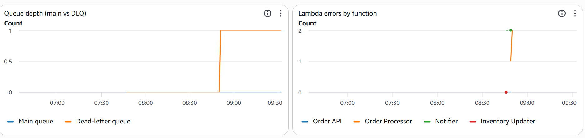
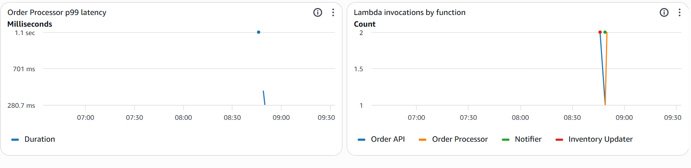

# event-driven-order-pipeline
Integration Engineer

## Architecture

A client request hits the Order API, lands in SQS, and is picked up by the Order
Processor, which persists it to DynamoDB and publishes an event to SNS, fanning
out to a Notifier and an Inventory Updater. Failed messages that exceed retry
limits land in a dead-letter queue instead of disappearing.

## Observability

Real telemetry from a live test run: the "Queue depth" panel shows the dead-letter
queue receiving a message after a simulated failure exhausted its 3 retry attempts,
while the main queue stayed at zero, unaffected. The "Lambda errors" panel shows the
corresponding error count on the Order Processor. A CloudWatch alarm watches the DLQ
and sends an email alert the moment a message lands there, so failures are surfaced
immediately rather than discovered later.