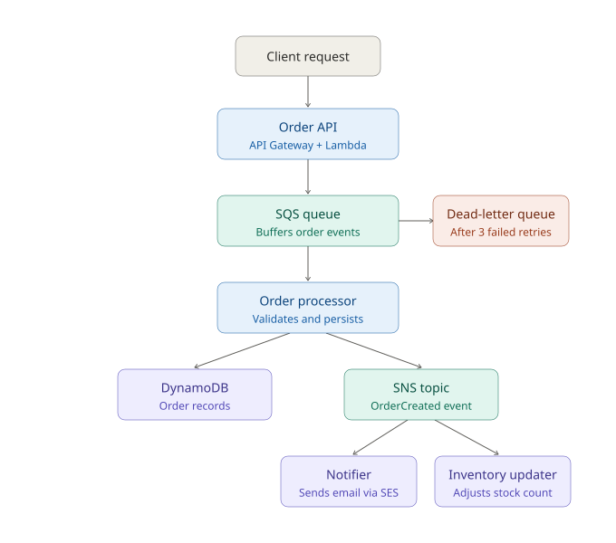

# event-driven-order-pipeline
Integration Engineer

## Architecture

A client request hits the Order API, lands in SQS, and is picked up by the Order
Processor, which persists it to DynamoDB and publishes an event to SNS, fanning
out to a Notifier and an Inventory Updater. Failed messages that exceed retry
limits land in a dead-letter queue instead of disappearing.